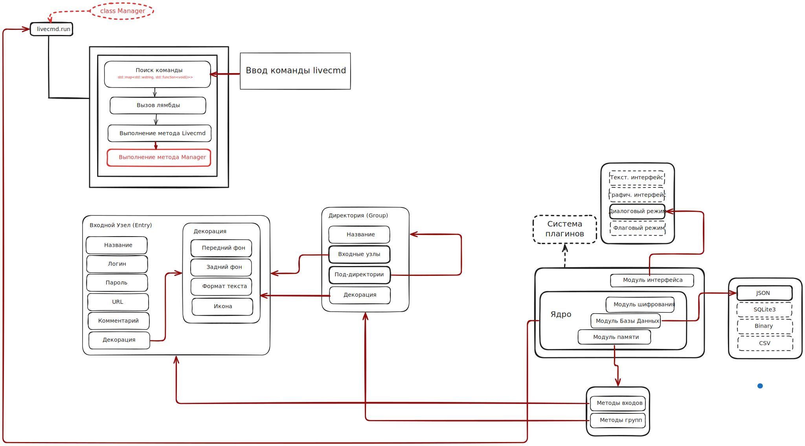

<h1 align=center>Классический менеджер паролей Nightlock</h1>

Менеджер хранения паролей Nightlock является учебным проектом, реализующий openSSL AES-CBC шифрование, рекурсивный доступ к древу паролей и интерфейс управления Livecmd.

<h3>1. Схема работы программы</h3>

<h3>2. Описание модулей программы</h3>

| Название | Описание |
|:--------- |:----------|
| `include/`   | заголовки |
| `requirements/`   | <a href="https://github.com/nlohmann">JSON Library</a> |
| `src/Crypt.cpp`   | AES-CBC |
| `src/Database.cpp`   | JSONDB |
| `src/Manager.cpp`   | Entry-методы |
| `src/formatkit.cpp`   | Цвета и форматы ANSI-терминала |
| `src/init.cpp`   | инициализация ANSI |
| `src/kernel.cpp`   | точка входа |
| `src/livecmd.cpp`, `src/livecmd`   | пользовательский интерфейс |
| `src/readsecret.cpp`   | Замена символов на "*" при вводе паролей |
| `src/split.cpp`   | Разбить строку на слова |
| `src/utils.cpp`   | Wstring, string, json |

